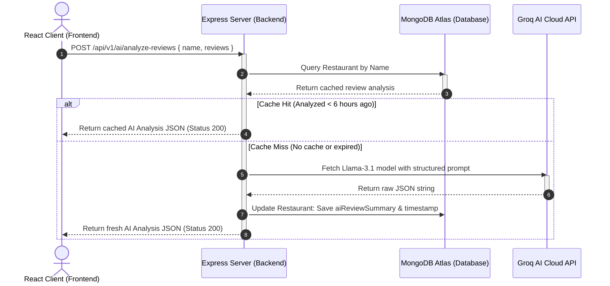
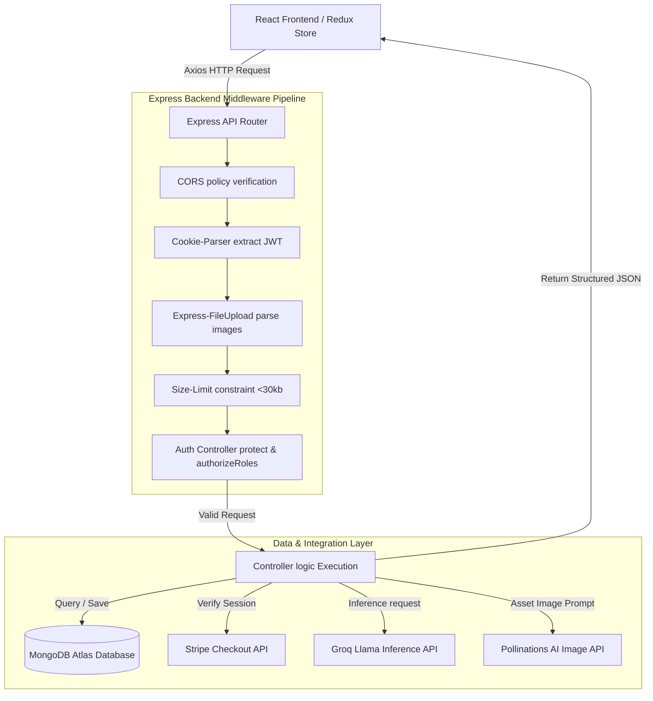
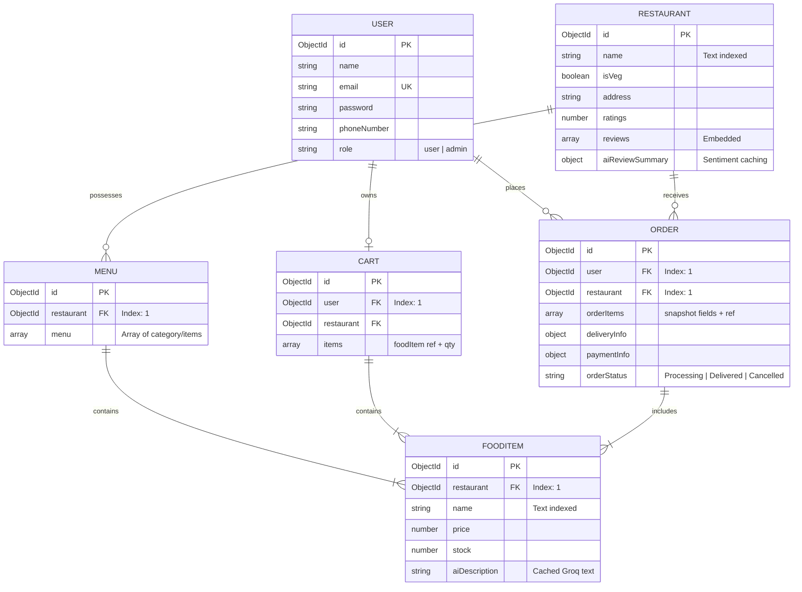
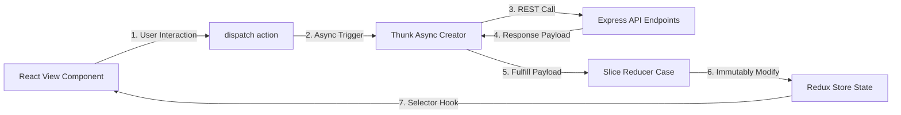
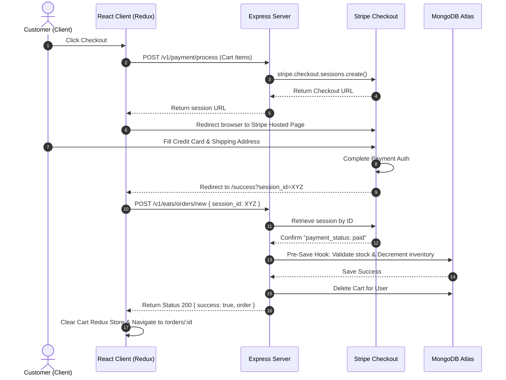
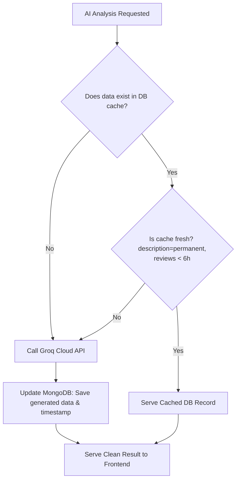

# MERN Stack AI-Powered Food Delivery Application: Project Interview Guide & Study Guide

Welcome to the comprehensive study and explanation guide for your MERN Stack Food Delivery Application. This document is structured as a **10-page master guide** designed to help you study, practice, and confidently articulate the technical and design aspects of your application to hiring managers and technical interviewers.

---

## Table of Contents
1. [Module 1: Executive Overview & Value Proposition](#module-1-executive-overview--value-proposition)
2. [Module 2: Technical Stack & System Architecture](#module-2-technical-stack--system-architecture)
3. [Module 3: Database & Mongoose Schema Architecture](#module-3-database--mongoose-schema-architecture)
4. [Module 4: Global State Management (Redux Toolkit)](#module-4-global-state-management-redux-toolkit)
5. [Module 5: Payment Processing & Checkout Lifecycle (Stripe)](#module-5-payment-processing--checkout-lifecycle-stripe)
6. [Module 6: Intelligent Integrations: Groq AI & Pollinations AI](#module-6-intelligent-integrations-groq-ai--pollinations-ai)
7. [Module 7: Security, Resilience & Error Handling Systems](#module-7-security-resilience--error-handling-systems)
8. [Module 8: Complete Mock Interview Preparation (Q&A Guide)](#module-8-complete-mock-interview-preparation-qa-guide)
9. [Module 9: 5 Essential System Diagrams for Interviews](#module-9-5-essential-system-diagrams-for-interviews)

---

## Module 1: Executive Overview & Value Proposition

### What is the Project?
This project is a premium, production-ready, full-stack B2C Food Ordering and Delivery Application built using the **MERN (MongoDB, Express, React, Node.js)** stack. Going beyond a standard CRUD app, it features **Intelligent AI Integrations** (using the Groq and Pollinations AI APIs), robust **payment orchestration** (via Stripe Checkout), state-of-the-art **state management** (Redux Toolkit), and transactional **database mechanics** (Mongoose pre-save hooks and automated inventory management).

### Core Business Features
1. **Interactive Store Discovery**: Users can browse, search (text-search), and filter restaurants (e.g., Veg/Non-Veg filters, ratings).
2. **Unified Shopping Cart**: Persistent backend-synchronized shopping cart that enforces business rules, such as preventing users from mixing menu items from different restaurants in a single order (cart auto-clears with a user warning if they switch restaurants).
3. **Stripe Payment Gateway**: A fully secure checkout flow using Stripe Checkout Sessions, allowing customers to pay in local currencies (`INR`) and input their shipping details securely on Stripe-hosted landing pages.
4. **Order Management & Stock Restorations**: Customers can view order details, track statuses, and cancel orders within a specified window. Canceling an order automatically restores inventory levels in MongoDB.
5. **AI Genie Menu Assistant**: Uses **Groq API (Llama-3.3-70b-versatile)** to generate appetizing culinary descriptions for food items in real-time, caching results in the database to prevent redundant API charges.
6. **AI Review Sentiment Analyser**: Uses **Groq API (Llama-3.1-8b-instant)** to analyze customer reviews, producing a sentiment rating (Positive/Neutral/Negative), pros/cons bullet points, and an AI verdict. Features a 6-hour database caching TTL.
7. **Automated AI Food Photography**: On server startup, a background worker queries food items lacking images and automatically generates professional food photography prompts via **Pollinations AI**.

---

## Module 2: Technical Stack & System Architecture

### The Tech Stack
*   **Frontend**: React (Vite-powered, ES Modules), Redux Toolkit (State Management), React Router DOM (Routing), React-Toastify (System Notifications), FontAwesome (Icons).
*   **Backend**: Node.js, Express.js (RESTful MVC Architecture), Pug Template Engine (Email/Template views).
*   **Database**: MongoDB Atlas (Cloud database), Mongoose ODM.
*   **Third-Party Services**: Stripe (Payments), Groq API (AI Inference), Pollinations AI (Image Generation), Cloudinary (Static Asset Management).

### Architecture & Request Lifecycle
The backend operates under an MVC (Model-View-Controller) structure where routes delegate logic to specialized controller modules. Below is the request-response lifecycle of a typical client interaction (e.g., requesting AI reviews):



---

## Module 3: Database & Mongoose Schema Architecture

Your data model consists of 6 primary collections. Below is the detailed breakdown of the schema fields, associations, indexes, and automated pre-save business logic.

### 1. User Schema (`User`)
*   **Fields**: `name` (String, max 30 chars), `email` (String, unique, lowercase, validated), `password` (String, select: false), `passwordConfirm` (String, custom validator checking password match), `phoneNumber` (String, matches 10 digits), `role` (enum: ['user', 'admin']), `avatar` (public_id, url), `passwordChangedAt` (Date), `passwordResetToken` (String), `passwordResetExpires` (Date).
*   **Pre-Save Hook**: Hashing user passwords using **BcryptJS (12 salt rounds)**. It only hashes the password if it has been modified, and clears out the temporary `passwordConfirm` field by setting it to `undefined`.
*   **Instance Methods**:
    *   `correctPassword(candidatePassword, userPassword)`: Compares candidate passwords to the database hash using `bcrypt.compare`.
    *   `getJWTToken()`: Generates a signed JSON Web Token containing the user's ID, expiring based on the configuration (e.g., 90 days).
    *   `createPasswordResetToken()`: Generates a cryptographically secure random token, hashes it using `sha256` to store in the DB, and sets expiration to 10 minutes.

### 2. Restaurant Schema (`Restaurant`)
*   **Fields**: `name` (String, required), `isVeg` (Boolean), `address` (String), `ratings` (Number), `numOfReviews` (Number), `location` (GeoJSON coordinates), `images` (List of { public_id, url }), `reviews` (Array of { name, rating, Comment }), `aiReviewSummary` (embedded object storing AI-analyzed sentiment, pros, cons, and AI verdict).
*   **Performance Optimization**: A Mongoose index is placed on `{ name: "text" }` to support low-latency wildcard text searches.

### 3. Menu Schema (`Menu`)
*   **Fields**: `restaurant` (ref: `Restaurant`), `menu` (Array of category items: `{ category: String, items: [ref: FoodItem] }`).
*   **Index**: Compound index `{ restaurant: 1 }` for rapid retrieval when browsing store menus.

### 4. FoodItem Schema (`FoodItem`)
*   **Fields**: `name` (String), `price` (Number), `description` (String), `ratings` (Number), `images` (List of { public_id, url }), `menu` (ref: `Menu`), `stock` (Number), `restaurant` (ref: `Restaurant`), `reviews` (List of customer reviews), `aiDescription` (String, cached Groq response).
*   **Index**: Text index `{ name: "text", description: "text" }` for keyword food search, and simple index `{ restaurant: 1 }` to lookup food items belonging to a restaurant.

### 5. Order Schema (`Order`)
*   **Fields**: `deliveryInfo` (address, city, phoneNo, postalCode, country), `restaurant` (ref: `Restaurant`), `user` (ref: `User`), `orderItems` (Array of inline items: name, quantity, image, price, fooditem), `paymentInfo` (id, status), `paidAt` (Date), `itemsPrice`, `taxPrice`, `deliveryCharge`, `finalTotal` (Numbers), `orderStatus` (Processing, Delivered, Cancelled), `deliveredAt`, `cancelledAt`, `cancelledReason`.
*   **Transaction Stock Check Hook (`pre("save")`)**:
    When an order is created, the system runs an atomic stock check. It loops through the `orderItems` and queries the `FoodItem` collection.
    ```javascript
    orderSchema.pre("save", async function () {
      if (!this.isNew) return;
      for (const orderItem of this.orderItems) {
        const foodItem = await mongoose.model("FoodItem").findById(orderItem.fooditem);
        if (!foodItem) throw new Error("Food item not found.");
        if (foodItem.stock < orderItem.quantity) {
          throw new Error(`Insufficient stock for '${orderItem.name}' in this order.`);
        }
        foodItem.stock -= orderItem.quantity;
        await foodItem.save();
      }
    });
    ```
*   **Stock Restoration Logic**:
    If an order is cancelled, a corresponding query is made to increment the inventory levels:
    ```javascript
    for (const item of order.orderItems) {
      const foodItem = await FoodItem.findById(item.fooditem);
      if (foodItem) {
        foodItem.stock += item.quantity;
        await foodItem.save({ validateBeforeSave: false });
      }
    }
    ```

### 6. Cart Schema (`Cart`)
*   **Fields**: `user` (ref: `User`), `restaurant` (ref: `Restaurant`), `items` (Array of `{ foodItem: ref: FoodItem, quantity: Number }`).
*   **Cart Isolation Business Rule**:
    To avoid logistical complications, a cart can only contain items from a single restaurant. When a user adds an item:
    ```javascript
    if (cart.restaurant.toString() !== restaurantId) {
      // Clear out the previous restaurant's items from MongoDB
      await Cart.deleteOne({ _id: cart._id });
      // Create a clean cart with the new item
      cart = new Cart({
        user: userId,
        restaurant: restaurantId,
        items: [{ foodItem: foodItemId, quantity: requestedQuantity }],
      });
    }
    ```

---

## Module 4: Global State Management (Redux Toolkit)

The application utilizes **Redux Toolkit** to manage client-side state dynamically, eliminating prop-drilling.

### Store Configuration (`store.js`)
The root store aggregates five primary slices:
*   `restaurants`: Holds search queries, sorting options, and lists of loaded restaurant objects.
*   `menus`: Tracks category listings and individual food items for the active restaurant.
*   `user`: Holds the authenticated user object, authentication status, error states, and loading indicators.
*   `cart`: Synchronizes client cart additions/removals with backend API routes.
*   `orders`: Stores active orders, order history, and cancellation states.

### State Synchronization Lifecycle Diagram
Below is the data lifecycle showing how client actions map through Redux to express controllers:

```
[UI Interaction: Add Item] ──► [Dispatch: addItemToCart(id, qty)] 
                                              │
                                              ▼ (HTTP POST /api/v1/eats/cart)
[State Update in Redux]   ◄── [Reducer success payload] ◄── [Express returns updated Cart JSON]
```

---

## Module 5: Payment Processing & Checkout Lifecycle (Stripe)

Your application integrates **Stripe Checkout Sessions** to delegate card security and compliance to Stripe's hosted platform.

### The Checkout Process Flow
1.  **Initiation**: The user triggers checkout on the React client.
2.  **Session Creation**: The frontend sends the cart array to the backend controller (`processPayment`).
3.  **Configuring Line Items**: The backend map items to Stripe format, formatting amounts in the smallest currency unit (paise for `INR`), and adding a delivery charge of `40 INR` (input as `4000` paise):
    ```javascript
    const session = await stripe.checkout.sessions.create({
      customer_email: req.user.email,
      phone_number_collection: { enabled: true },
      line_items: req.body.items.map(item => ({
        price_data: {
          currency: "inr",
          product_data: { name: item.foodItem.name, images: [item.foodItem.images[0].url] },
          unit_amount: Math.round(item.foodItem.price * 100), // convert to paise
        },
        quantity: item.quantity,
      })),
      mode: "payment",
      shipping_address_collection: { allowed_countries: ["IN", "US"] },
      shipping_options: [{
        shipping_rate_data: {
          display_name: "Delivery Charges",
          type: "fixed_amount",
          fixed_amount: { amount: 4000, currency: "inr" },
          delivery_estimate: { minimum: { unit: "hour", value: 1 }, maximum: { unit: "hour", value: 3 } }
        }
      }],
      success_url: `${process.env.FRONTEND_URL}/success?session_id={CHECKOUT_SESSION_ID}`,
      cancel_url: `${process.env.FRONTEND_URL}/cart`,
    });
    ```
4.  **Client Redirect**: The backend returns the `session.url` to the client, redirecting the user to Stripe.
5.  **Success Callback**: Upon successful payment, Stripe redirects the client to the `/success?session_id=...` route on the frontend.
6.  **Payment Verification & Order Creation**:
    *   The `/success` component sends the `session_id` back to the Express server at `POST /api/v1/eats/orders/new`.
    *   The server calls `stripe.checkout.sessions.retrieve(session_id)` to verify payment completion.
    *   Once verified, the server constructs the `Order` record, clears the active `Cart` in MongoDB, and returns the new order ID.
    *   The frontend dispatches `clearCart()` to reset Redux store levels and navigates to the order details page.

---

## Module 6: Intelligent Integrations: Groq AI & Pollinations AI

This application features advanced AI agents that run either on-demand or as asynchronous processes.

### 1. Genie AI Food Descriptions
*   **Technical Pipeline**: Utilizes the **Groq API** with the high-performance **Llama-3.3-70b-versatile** model.
*   **Prompt Design**: Instructs the model to act as a culinary copywriter for Indian cuisine, producing a concise, appetizing 2-3 sentence description.
*   **Caching Strategy**: In order to minimize API costs, before initiating a request to Groq, the database is queried. If the target `FoodItem` has `aiDescription` cached, it is served immediately. If not, the generated description is saved to MongoDB.

### 2. AI Review Sentiment Analyser
*   **Technical Pipeline**: Utilizes the **Groq API** with the **Llama-3.1-8b-instant** model, forcing a raw JSON output structure.
*   **Prompt Design**: Reviews are truncated (to stay within token limits) and passed to the model. The model must output a JSON schema containing `sentiment` ("Positive" | "Neutral" | "Negative"), arrays for `key_pros` and `key_cons`, and a 1-2 sentence `ai_verdict`.
*   **Dynamic Cache TTL**: Analysing reviews is computationally heavy. Results are cached under `aiReviewSummary` on the `Restaurant` model. When requested, the system calculates time elapsed since `lastAnalyzed`. If less than 6 hours (21,600,000 ms), the cached summary is served. If expired, a fresh analysis is requested.

### 3. Automated Seeding & AI Image Generation
*   **Technical Pipeline**: Uses **Pollinations AI** for text-to-image mapping.
*   **Execution Flow**: In `server.js`, a timeout triggers 3 seconds after boot:
    ```javascript
    setTimeout(async () => {
      const items = await FoodItem.find({});
      for (let item of items) {
        if (!item.images || !item.images[0]?.url.includes("pollinations")) {
          const prompt = `${item.name} delicious food professional food photography 4k`;
          const url = `https://image.pollinations.ai/prompt/${encodeURIComponent(prompt)}?width=600&height=400&nologo=true`;
          
          item.images = [{ public_id: `dyn_${item._id}`, url: url }];
          await item.save();
        }
      }
    }, 3000);
    ```
    This automatically formats a professional photography prompt, requests the image dynamically, and seeds the MongoDB image field.

---

## Module 7: Security, Resilience & Error Handling Systems

### 1. Application Layer Security
*   **JWT Verification**: Requests to protected routes must pass the `protect` middleware, verifying the token from signed cookies.
*   **Role-Based Access Control**: An admin verification middleware (`authorizeRoles("admin")`) protects endpoints like delete actions.
*   **DOS Prevention**: Node parser size limits are restricted to `30kb` on JSON and URL-encoded requests to prevent large payload memory attacks.
*   **Encryption**: Secure password hashing via `bcrypt` (12 rounds) and hashing of password reset tokens in database storage.

### 2. Error Handling Middleware
A centralized error-handling middleware overrides default Express error HTML formatting. It intercepts standard operational errors, mapping them to structured JSON responses:
*   **CastError (Mongoose)**: Re-mapped to "Resource not found" (Status 404).
*   **ValidationError**: Formats validation errors (e.g., mismatched passwords, invalid emails) into clean messages.
*   **JsonWebTokenError**: Re-mapped to "JSON Web Token is invalid. Try again!" (Status 401).
*   **TokenExpiredError**: Re-mapped to "JSON Web Token is expired" (Status 401).

### 3. Global Resilience Handlers
The system listens to uncaught server errors to prevent unexpected process crashes:
*   **Uncaught Exceptions**: Intercepts syntax errors or undeclared modules, logging the stack trace, and executing a safe shutdown (`process.exit(1)`).
*   **Unhandled Promise Rejections**: Triggers if an async database query fails without a catch block, closing the server cleanly to release active ports.
*   **Live Server Restart**: The `/api/v1/restart` route allows developers to trigger a safe server reboot. It spawns a child process replicating the startup arguments and gracefully terminates the parent process:
    ```javascript
    const { spawn } = require("child_process");
    const child = spawn(process.argv[0], process.argv.slice(1), {
      detached: true,
      stdio: "inherit",
      cwd: process.cwd()
    });
    child.unref();
    process.exit(0);
    ```

---

## Module 8: Complete Mock Interview Preparation (Q&A Guide)

Use this section to prepare for technical interview questions related to the architecture and implementation of this project.

### Q1: Can you walk me through the system architecture of this project?
> **Answer**: This is a full-stack web application built on the MERN stack. The frontend is built using React (Vite-powered) and manages global state using Redux Toolkit. The backend is built using Node.js and Express.js, adopting a RESTful MVC pattern. Data is stored in MongoDB Atlas, which is managed in the codebase using Mongoose ODM.
> 
> When a client makes a request, it passes through middleware (like CORS, cookie-parser, and auth validation). The request is routed to a controller, which interacts with MongoDB models or triggers external services like Stripe (for checkout processing) or Groq AI (for menu analysis). The backend returns clean JSON payloads, which update the Redux store on the frontend, triggering a re-render of React components.

### Q2: What security measures did you implement for user authentication?
> **Answer**: I implemented security at multiple levels:
> 1. **Password Hashing**: User passwords are encrypted using BcryptJS with 12 salt rounds before they are stored in the database.
> 2. **JWT in HTTP-Only Cookies**: After authentication, a JSON Web Token (JWT) is generated and sent to the client via an HTTP-Only cookie, protecting it from Cross-Site Scripting (XSS) attacks.
> 3. **Input Sanitization and Payload Limits**: I configured Express body parsers with a strict `30kb` payload limit to protect the server from Denial of Service (DoS) attacks.
> 4. **Token Expirations & Reset Tokens**: Password reset tokens are generated using crypto, hashed with SHA-256 before database storage, and have a strict 10-minute expiration window.

### Q3: How did you implement Stripe checkout, and how do you prevent order creation if the payment fails?
> **Answer**: Instead of processing card details directly on my server, which would require high PCI-DSS compliance overhead, I integrated **Stripe Checkout Sessions**.
> 
> When the user clicks checkout, the cart items are sent to the backend, which creates a Stripe Session with line items, prices (converted to paise/INR), shipping limits, and a success callback URL containing `{CHECKOUT_SESSION_ID}`. 
> 
> The client is redirected to Stripe. If the payment fails or is cancelled, they are redirected back to the cart. If successful, Stripe redirects them to `/success?session_id=...`. The frontend intercepts this query, calls the server to verify the session status via Stripe's SDK, and only creates the order in MongoDB and deletes the cart once payment is confirmed.

### Q4: How do you handle inventory (stock) levels in your database during order creation and cancellation?
> **Answer**: I use Mongoose database-level pre-save hooks to maintain inventory consistency. 
> 
> In the `Order` schema, a `pre("save")` hook triggers before creating the order. It loops through the ordered food items, queries their current stock in MongoDB, verifies if there is sufficient stock, decrements the item's stock, and saves the updated food item document. If any item is out of stock, the hook throws an error, canceling the transaction.
> 
> If a customer cancels an order (within the allowed window), the controller loops through the order items and increments the stock levels back in MongoDB, ensuring inventory accuracy.

### Q5: Why did you choose Redux Toolkit for state management instead of React Context API?
> **Answer**: While React Context is fine for smaller apps, a food delivery app has highly dynamic state flows (real-time cart synchronization, user session tracking, restaurant lists, and search queries) which are accessed across distant components.
> 
> Redux Toolkit is optimized for performance, preventing unnecessary re-renders of the entire component tree when a slice of state updates. Redux DevTools also makes it easy to track state changes step-by-step during debugging.

### Q6: Can you explain the design decisions behind your AI features?
> **Answer**: I added AI features to improve the user experience:
> 1. **Genie AI Food Descriptions**: If a food item lacks a description, users can click the AI button. This uses Groq's Llama-3.3-70b-versatile model to write short, appetizing menu descriptions.
> 2. **AI Review Analyser**: Restaurant reviews are analyzed using Groq's Llama-3.1-8b-instant, which is instructed to return structured JSON containing sentiment, pros, cons, and a final verdict.
> 3. **AI Image Seeding**: During server startup, a background task checks for food items lacking images and queries Pollinations AI to generate high-resolution professional food photography.

### Q7: Groq AI has rate limits. How did you design the AI features to handle rate limits and reduce API costs?
> **Answer**: I implemented a **caching layer** inside the database models to avoid duplicate API requests.
> 
> For food descriptions, the generated description is saved directly to the `FoodItem` schema (`aiDescription` field). Subsequent requests check this field first; if populated, the cached text is served without contacting Groq.
> 
> For review analysis, the analysis object and a timestamp are stored under `aiReviewSummary` on the `Restaurant` model. When requested, the server checks if the analysis is less than 6 hours old. If so, it serves the cached data, preventing redundant API calls during periods of high traffic.

### Q8: What does the `/api/v1/restart` route do, and how is it implemented?
> **Answer**: It is a utility endpoint designed for deployment environments. It allows the server to reboot programmatically.
> 
> Using Node's `child_process` module, it spawns a detached child process running the same arguments and working directory as the parent process. Once the child is spawned and unreferenced, the parent process exits (`process.exit(0)`), allowing the system to run on the clean, restarted server instance.

### Q9: What happens in your cart controller if a user adds an item from "Restaurant B" when they already have items from "Restaurant A" in their cart?
> **Answer**: The application enforces a **Cart Isolation Rule**. In the `addItemToCart` controller, it checks if the new item's `restaurantId` matches the cart's active `restaurantId`. If they differ, the backend automatically deletes the old cart from MongoDB, creates a clean cart referencing the new restaurant, and adds the new item, ensuring logistics remain clear for delivery calculations.

### Q10: How does your application handle server-side errors, and what prevents the process from crashing due to uncaught promise rejections?
> **Answer**: I implemented global event listeners in `server.js` to catch unexpected exceptions:
> *   `process.on("uncaughtException")`: Captures synchronous errors (like referencing undefined variables), logs the error stack, and gracefully shuts down the server.
> *   `process.on("unhandledRejection")`: Intercepts unhandled asynchronous errors (like a database query failing without a catch block) and closes the active server listener before exiting.
> Centralized Express error-handling middleware is also configured to catch operational errors (like Mongoose CastErrors or validation errors) and return clean, structured JSON payloads to the frontend.

---

## Technical Performance Checklist (Keep in mind for interviews)
*   **API Response Time**: Leveraged indexing on foreign keys (`restaurant`, `user`) and text search properties to speed up database queries.
*   **External Integration Isolation**: Stripe keys and API tokens are dynamically loaded through environment variables, keeping credentials out of version control.
*   **Security Standards**: Used Bcrypt hashing and HTTP-Only cookies to protect session data.

---

## Module 9: 5 Essential System Diagrams for Interviews

These five structural diagrams map out the critical technical flows of your application. Use these to visualize the interactions when explaining them during system design or full-stack interview rounds.

### 1. Overall System Architecture & Request-Response Flow
This diagram illustrates the flow of a client request from the React UI down through security, middleware layers, backend routing, database retrieval, and external API execution.



---

### 2. Database Entity Relationship Diagram (ERD)
This diagram maps out the relations, collections, schema fields, and compound indexes that structure your MongoDB database.



---

### 3. Redux Toolkit State Management Cycle
This diagram details the unidirectional state flow utilized in the frontend to manage cart, checkout, user sessions, and restaurants dynamically.



---

### 4. End-to-End Stripe Checkout & Order Placement Flow
This diagram maps the transactional lifecycle of a purchase from card processing down to automated stock checking, order creation, and cart deletion.



---

### 5. Caching Layer Flow for Groq AI Integrations
This flowchart demonstrates the optimization logic used to cache AI descriptions and restaurant reviews in MongoDB, avoiding excessive API calls.



---

### How to use this study guide:
1. **Print/Convert to PDF**: Open this file in your editor, print or export it to PDF, and review the concepts regularly.
2. **Review Schema Hooks**: Pay close attention to Module 3 (Database schemas), especially the pre-save hooks. Interviewers frequently ask about transactional logic and how inventory is updated.
3. **Practice Q&A**: Read through the 10 questions in Module 8, practice speaking the answers out loud, and customize them to fit your voice.
4. **Study the Diagrams**: Trace the paths in the Module 9 diagrams. Being able to sketch these on a whiteboard is an excellent skill for technical interviews.

